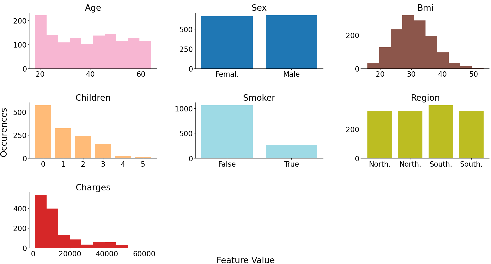
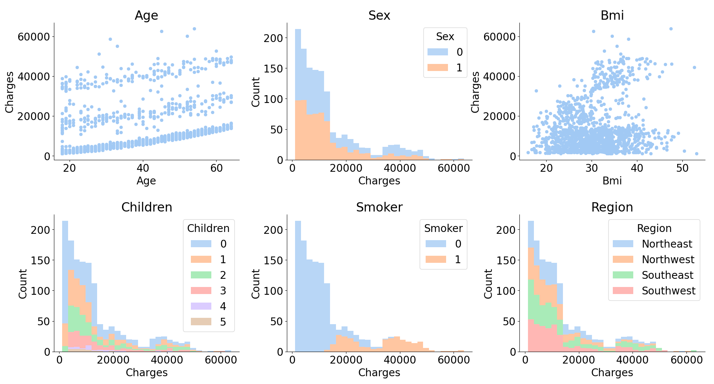
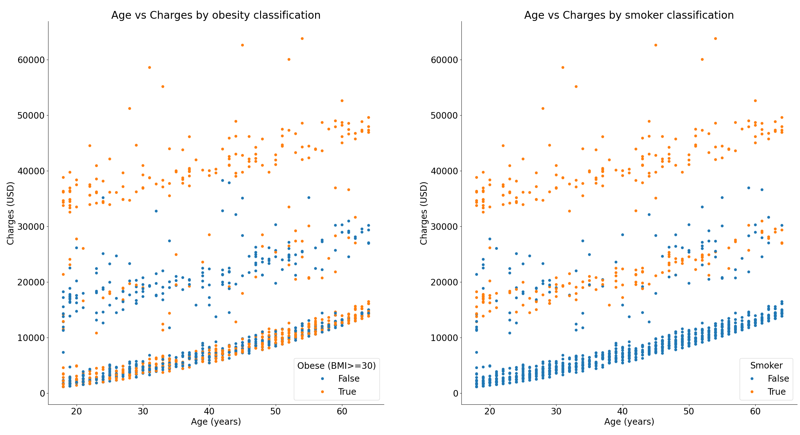
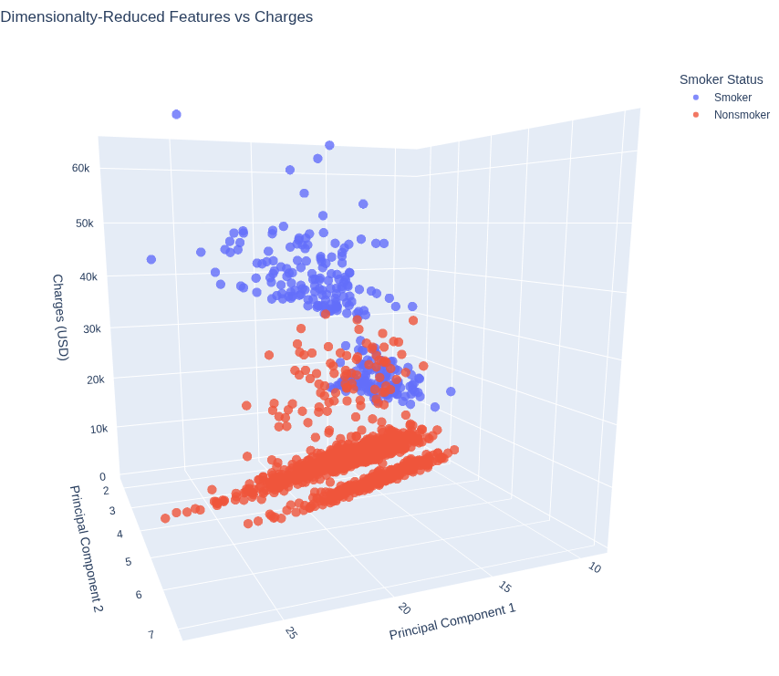

# Analysis of Health Insurance Information Using Linear Regression

## Executive Summary

Health insurance data was obtained from a public dataset. A regression analysis was performed to identify meaningful relationships between the recorded data about a customer and the charges incurred by that customer.

It was noted that the gender of the customer and residence in the most quadrants (excluding the Southwest) had no statistically significant impact on the charges incurred by a customer. Status as a smoker was very influential (smokers, on average, incur a cost of $24,413.39 more than their non-smoking counterparts). Number of children, BMI, age, and residency in the Southwest had significant impacts and are also targets for cost reduction measures.

## Business Problem

The costs incurred by an insurance company are large and highly variable (ranging from $1,121.87 to $63,770.43 in this dataset). This suggests an opportunity for cost minimization. Insight from these data can guide initiatives within the firm to promote customer well-being and reduce expenses.

## Methods

1. Data were cleaned and explored in Python using the libraries Pandas, Matplotlib, and Seaborn.
2. A linear regression model was fitted with Statsmodels to answer the business question.
3. To correct for multiple comparisons, Scipy was used to perform a Benjamini-Hochberg correction to control the false discovery rate.
4. A principal component analysis was performed using Sci-Kit Learn to represent the data in fewer dimensions.
5. A 3-D scatterplot was created to visualize the primary takeaways of this analysis using Plotly.

## Results

After some basic cleaning and descriptive analysis, univariate and bivariate visualizations were generated for these data.





The correlations between each feature were also visualized to identify potential multicolinearities or relationships with a strong connection.


The banding on the scatterplot showing age vs charges was an interesting finding. Repeat plots were created using color to distinguish a secondary feature, the most interesting of which are shown here.



A linear regression was performed.

```txt
                       Results: Ordinary least squares
=============================================================================
Model:                  OLS                 Adj. R-squared:        0.753
Dependent Variable:     charges             AIC:                   21711.9517
Date:                   2025-12-11 18:09    BIC:                   21756.7220
No. Observations:       1069                Log-Likelihood:        -10847.
Df Model:               8                   F-statistic:           408.2
Df Residuals:           1060                Prob (F-statistic):    2.15e-317
R-squared:              0.755               Scale:                 3.8427e+07
-----------------------------------------------------------------------------
                    Coef.     Std.Err.    t     P>|t|     [0.025     0.975]
-----------------------------------------------------------------------------
const            -11859.7757 1146.7890 -10.3417 0.0000 -14110.0101 -9609.5413
age                 269.4966   13.6353  19.7647 0.0000    242.7414   296.2517
sex                 110.6874  380.4946   0.2909 0.7712   -635.9209   857.2956
bmi                 325.3319   33.2226   9.7925 0.0000    260.1424   390.5214
children            419.1295  157.6420   2.6587 0.0080    109.8036   728.4554
smoker            24413.3908  472.5392  51.6643 0.0000  23486.1721 25340.6094
region_northwest   -494.9018  540.0480  -0.9164 0.3597  -1554.5864   564.7828
region_southeast   -994.9104  547.2215  -1.8181 0.0693  -2068.6709    78.8501
region_southwest  -1247.3173  549.3447  -2.2706 0.0234  -2325.2440  -169.3906
-----------------------------------------------------------------------------
Omnibus:                  237.684          Durbin-Watson:             2.018
Prob(Omnibus):            0.000            Jarque-Bera (JB):          567.989
Skew:                     1.190            Prob(JB):                  0.000
Kurtosis:                 5.662            Condition No.:             315
=============================================================================
Notes:
[1] Standard Errors assume that the covariance matrix of the errors is
correctly specified.
```

These raw p-values can also be adjusted to correct for the false discovery rate.

```txt
                   coefficient  adjusted p-value
const            -11859.775705          0.000000
age                 269.496557          0.000000
bmi                 325.331859          0.000000
smoker            24413.390757          0.000000
children            419.129542          0.014331
region_southwest  -1247.317328          0.035061
region_southeast   -994.910379          0.089137
region_northwest   -494.901826          0.404622
sex                 110.687358          0.771182

```

These lead to the conclusion that gender and residence in the Northwestern or Southeastern regions had no statistically significant impact on the incurred healthcare charges compared to customers in the Northeast. Status as a smoker, number of children, BMI, age, and residency in the Southwest had significant impacts.

In particular, the impact of smoking is pronounced. Smokers, compared to non-smokers, tend to incur costs that are $24,413.39 greater, on average. For every one-unit increase to age, BMI, and number of children, costs tend to increase by, on average, $269.50, $325.33, or $419.13 (respectively), per their respective regression coefficients.

The aforementioned banding to charges is also visible after principal component analysis to reduce the features so that they can be displayed in three dimensions (with two components) while still explaining 35.8% of the variance in all of the data. When color coded by smoker status, it is interesting to note that no smokers are in the cluster with the lowest charges and no non-smokers are in the cluster with the highest charges.



## Business Recommendations

The firm should aim to decrease its costs of total claims with initiatives targeting these attributes. Education resources can first be provided to customers above certain risk thresholds at minimal effort and expense. Subsidy and incentive programs could also be used to drive desirable changes.

Smokers should be targeted first and with the most resources from the firm due to the much larger effect smoking had on the prediction of cost than other parameters, as seen in its large regression coefficient. Smokers should be identified and sent resources on smoking cessation counseling and nicotine replacement therapies. These treatments could be covered by the insurance company to fully incentive their use. For patients in a particularly high-risk category (like a BMI greater than 30 and age over 65 years), it may even be prudent to hire employees who work with customers and ensure that they are able to navigate to the resources needed to reach a desirable outcome and to create an accountability system. Nonsmokers and customers who have fully quit smoking can be given discounts as an additional incentive.

Number of children was the predictor with the next-most impact. Incentivizing customers to not have families would be unethical and could have far-reaching consequences, but providing resources to educate and equip customers would be appropriate. Giving customers of child-bearing dispositions access to family planning resources is an suitable starting intervention.

BMIs greater than 25 are considered overweight. Customers with a BMI of at least 25 can be given resources on diet, nutrition, and exercise. Gym subsidies or partnerships would also be prudent. The insurance firm could partner with a gym chain to provide gym membership discounts to policy holders or to provide insurance premium disocunts for members who regularly check into a gym or log smartwatch fitness activity (somewhat similar to the "good student discount" many automotive insurance firms provide).

Age, as an immutable characteristic, is also difficult to use as an actionable insight in an ethical way. However, scarce or more costly wellness resources could be preferentially offered to seniors. Encouraging senior citizens to keep up with health screenings and immunizations with promotions and follow-ups would be an ethical and easy starting point.

Patients in the Southwest region tended to have lower charges. Though it is possible this is a false positive (p=0.035), further analysis to determine the underlying cause is appropriate. If healthcare is cheaper in this region or if lifestyle factors prominent in this area have salutary effects, it may be appropriate to encourage customers to seek healthcare or residence in these areas or to encourage adoption of any positive lifestyle changes in other regions.

## Future Analysis Directions

Future analysis could seek to further analyze the banding apparent on the PCA plot above. These clusters may be possible to classify as "low cost," "medium cost," and "high cost;" these labels would allow more focused interventions based on the above factors (for example, prioritizing gym resources to customers in the "high cost" category). Ample machine learning classification algorithms would even allow integration of these findings into other operations.

Analysis of the root cause of the apparently reduced costs in the southwest could allow the firm to apply whatever benefits exist to other regions.

A-B testing could be done by performing a t-test on the charges to a sample of smokers before and after the intervention began. This could be generalized to each of the above recommendations to ensure that the cost incurred by these interventions is a worthwhile tradeoff.
